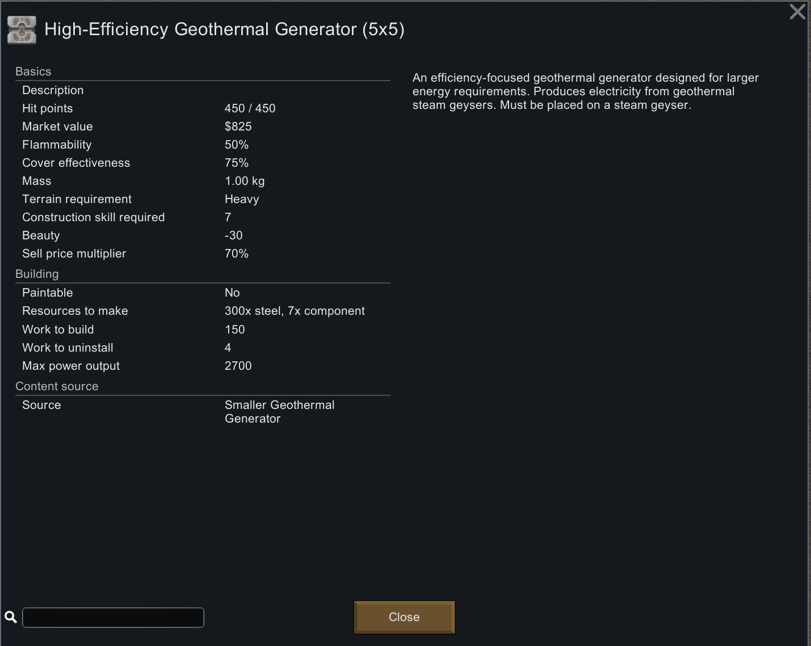
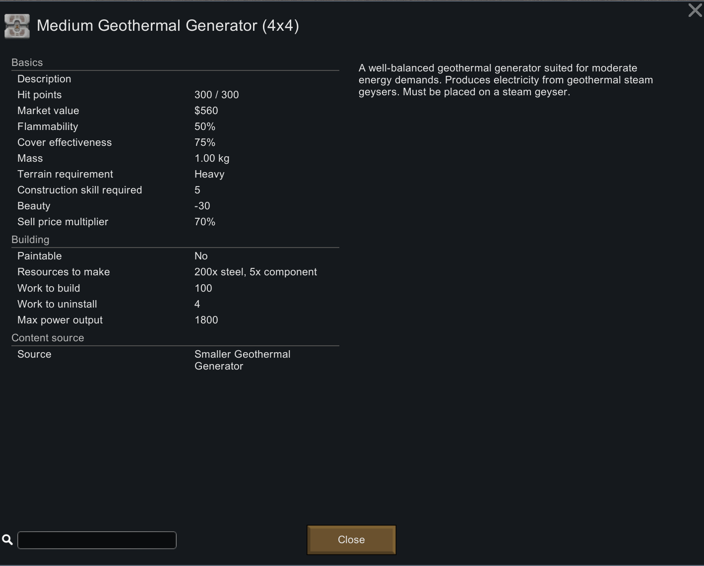
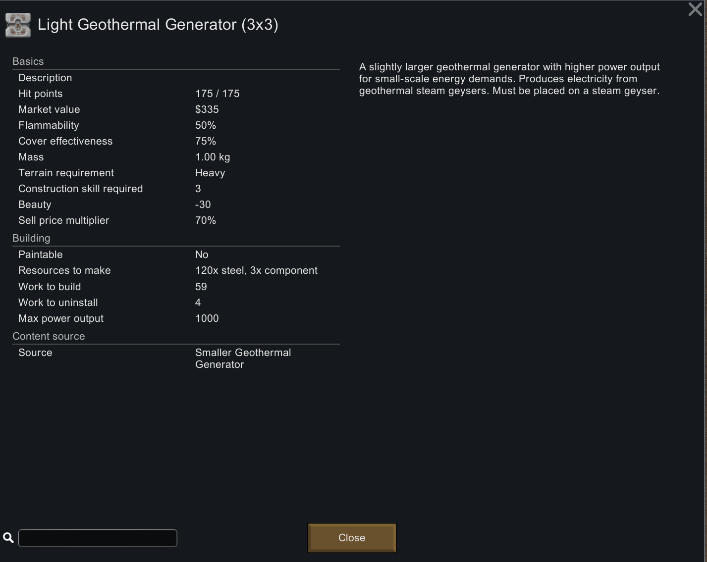
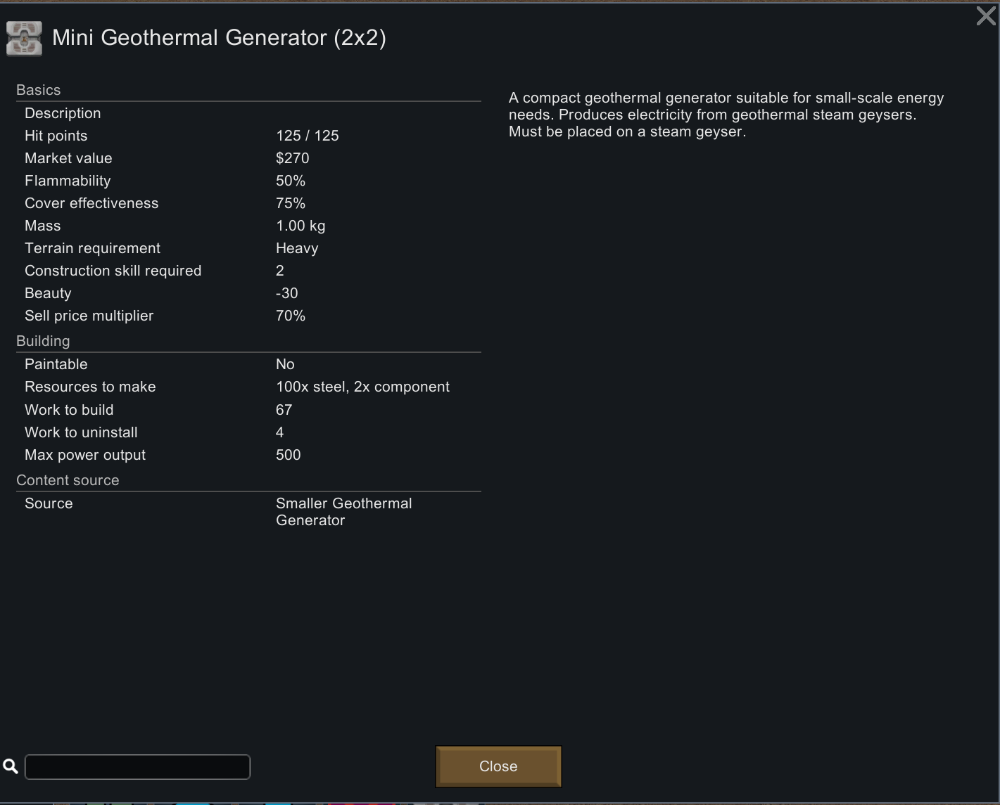

# SmallerGeothermalGenerator

[繁體中文說明](./README.zh.md) | [English README](./README.md)
-
## Introduction:
This is a simple RimWorld mod that resized the vanilla geothermal generator, adding four new sizes: 2x2, 3x3, 4x4, and 5x5.

To enhance realism in the game, the related values for the four new geothermal generators added in this mod, including `max power output`, `resources to make`, `max hit points`, `work to make`, and `required construction skill levels`, have all been adjusted.

Apart from the values listed above, theoretically, all other building attributes or stats are consistent with the vanilla geothermal generator.

## How to use:

Subscribe or download this mod and enable it in the game to use. Please note that the added four new geothermal generators in this mod require the research - "Geothermal Power" to be completed before construction. Additionally, each generator has specific required construction skill levels, which you can find detailed in the table below.

| Name                        | Area          | Power (W) | Power per Unit Area (W/Tile) | Resources to Make        | HP  | Work to Make | Construction Skill Required |
|-----------------------------|---------------|-----------|-----------------------------|--------------------------|------|--------------|-----------------------------|
| Mini Geothermal Generator (2x2)      | 4 Tiles       | 500       | 125                         | 50 Steel, 2 Components   | 75   | 1500         | 2                           |
| Light Geothermal Generator (3x3)     | 9 Tiles       | 1000      | 111.1                       | 120 Steel, 3 Components  | 175  | 3500         | 3                           |
| Medium Geothermal Generator (4x4)    | 16 Tiles      | 1800      | 112.5                       | 200 Steel, 5 Components  | 300  | 6000         | 5                           |
| Efficient Geothermal Generator (5x5) | 25 Tiles      | 2700      | 108                         | 300 Steel, 7 Components  | 450  | 9000         | 7                           |
| Geothermal Generator (6x6) (Vanilla) | 36 Tiles      | 3600      | 100                         | 340 Steel, 8 Components  | 500  | 12000        | 8                           |

## Language:
Currently, I use Copilot and ChatGPT for translations. This mod includes built-in support for Traditional Chinese, Simplified Chinese, and English. This is a simple mod, with English set as the default language. If translations for other languages are needed, due to limitations in maintenance resources, they cannot all be integrated into the mod. You are welcome to develop and upload your own language translation mods.

## Compatibility:
- In my personal save file, which includes over 300 mods, this mod works perfectly without any major issues. It can be safely added to an existing save or removed from an existing save. Removing from an existing save will not cause errors. However, removing this mod from existing save cause any previously built structures to vanish, potentially leading to interruptions in your base's power supply.

- Currently known to be incompatible with the mod - [Geothermal Power Extenders](https://steamcommunity.com/sharedfiles/filedetails/?id=3373466885).
    - You can still enable both this mod and the Geothermal Power Extenders mod in the game at the same time.
    - The Geothermal Power Extenders mod adds an extension building, which requires placement next to a geothermal generator. However, this extension building cannot be placed next to the four new geothermal generators added by this mod.
    - The likely reason is that the `defNames` of the four new geothermal generators in this mod are not included in the `PlaceWorker` method checks of the extension building.

## Other Notes:
- This mod does not rely on any specific other mods and can be used independently. 

- If you are using mods that restrict technologies, such as [Rimedieval](https://steamcommunity.com/sharedfiles/filedetails/?id=2516523040) or [World Tech Level](https://steamcommunity.com/sharedfiles/filedetails/?id=3414187030), which prevent the "Geothermal Power" research, you will be unable to construct the geothermal generators provided by this mod. Naturally, the vanilla will also be unbuildable.

- It is recommended to use it alongside with [[Ling]Move Steam Geyser](https://steamcommunity.com/sharedfiles/filedetails/?id=1547361568) or [MinifyEverything](https://steamcommunity.com/sharedfiles/filedetails/?id=872762753). The main reason is that for the 3x3 and 5x5 models of geothermal generators, the construction center point is not exactly in the middle, making it less intuitive. As a result, you may often need to reposition steam geysers to fit the layout of your base.

- This mod directly uses the vanilla's geothermal generator texture. If you are using other mods that overwrite the original texture, this mod may be affected.

## Latest Mod Version:
- Version: 1.5-20250402
- Compatible with RimWorld 1.5
