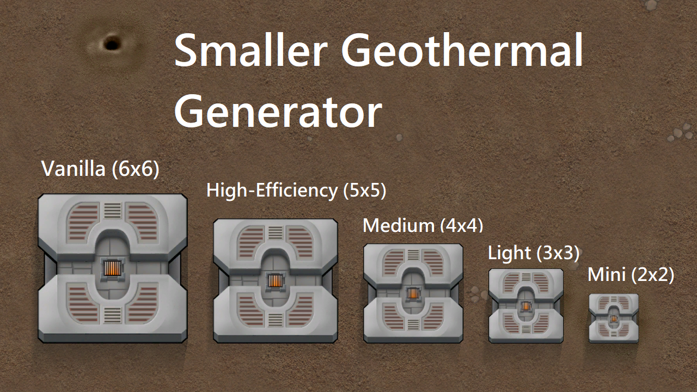
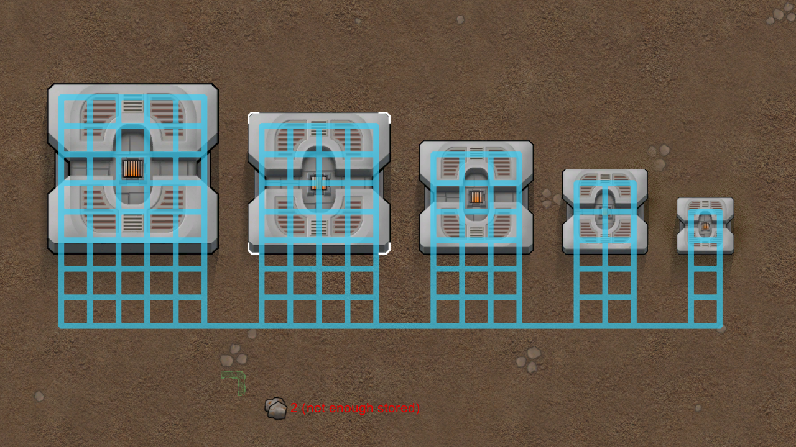
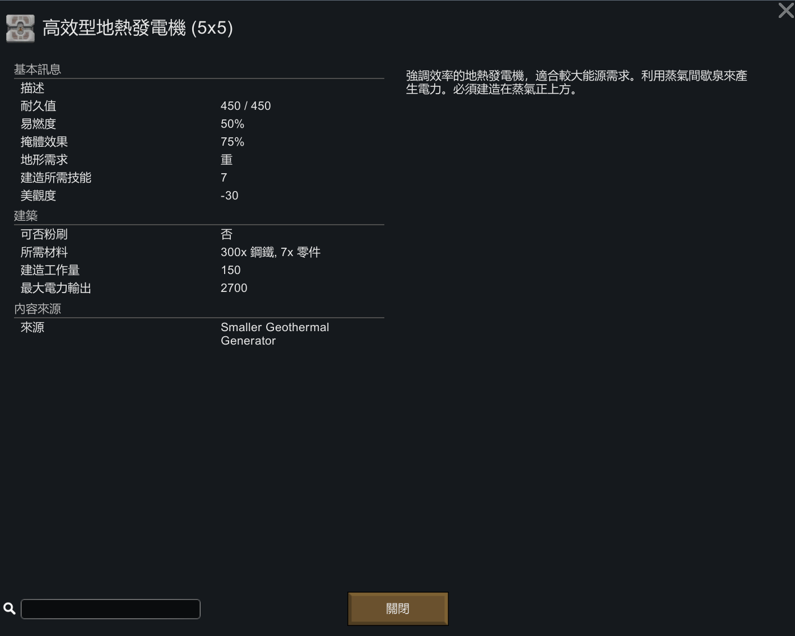
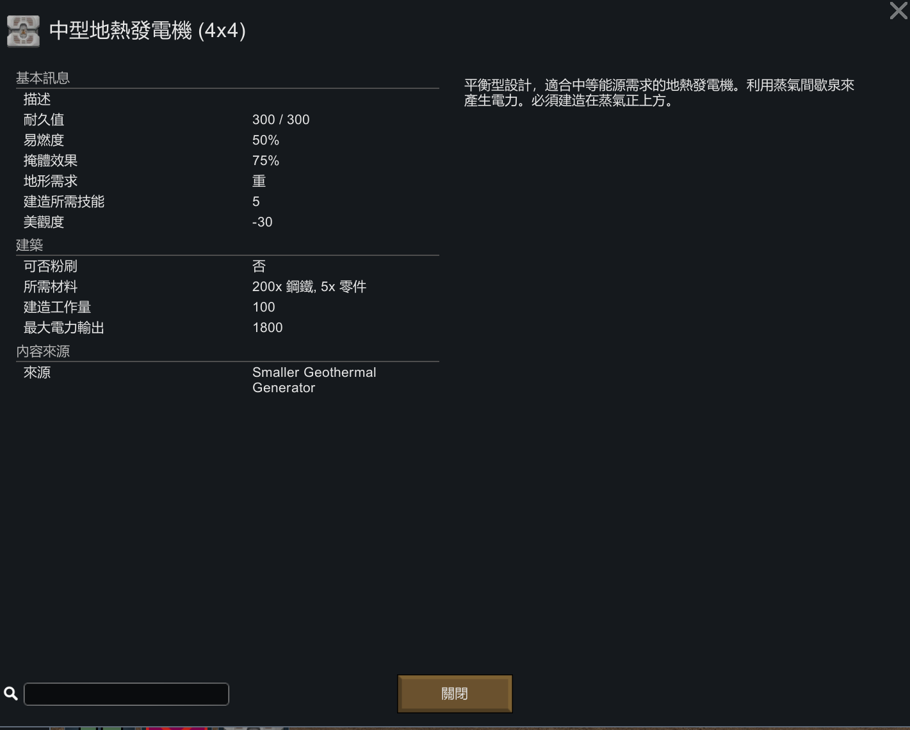
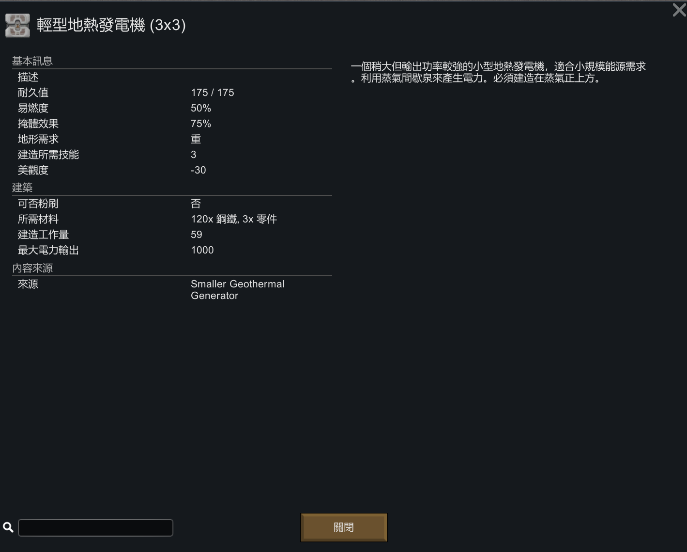
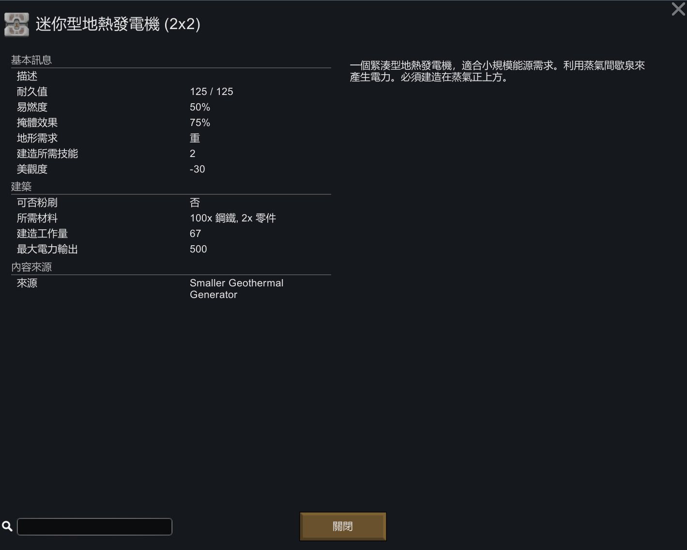

# 更小的地熱發電機 (SmallerGeothermalGenerator)

[繁體中文說明](./README.zh.md) | [English README](./README.md)
-
## 介紹:
這是一個簡易的 RimWorld 模組，本模組依照原版的地熱發電機調整了大小，新增了: 2x2、3x3、4x4 和 5x5 等，總共四種尺寸的地熱發電機。

為了更符合現實，本模組新增的 4 種地熱發電機的相關數值，包含`電力輸出功率 (W)`、`建造所需要的資源`、`耐久度`、`建造工作量`、`建造所需要等級`，都有所調整。

除了上述所列舉的數值之外，理論上其他的建築物屬性或特性，皆與原版的地熱發電機一致。

你也可以在模組設定中，調整`電力輸出功率 (W)`以及 `建造所需要的資源`

## 如何使用:
1. 前往 [Steam Workshop](https://steamcommunity.com/sharedfiles/filedetails/?id=3456671049) 訂閱本模組或是從 [release page](https://github.com/emoryoakley/SmallerGeothermalGenerator/releases) 下載本模組。
2. 在遊戲中啟用本模組 (無特別載入順序)。
3. 在遊戲中研究"地熱發電"，完成後才可以建造。

## 發電機資訊:
| 名稱                        | 面積           | 電力輸出功率 (W) | 每面積單位產生的電力輸出功率 (W/格) | 建造所需要的資源       | 耐久度 | 建造工作量 | 建造所需等級 |
|-----------------------------|----------------|------------------|----------------------------------|------------------------|--------|------------|---------------|
| 迷你型地熱發電機 (2x2)      | 4 格           | 500              | 125                              | 50 Steel, 2 Components | 75     | 1500       | 2             |
| 輕型地熱發電機 (3x3)        | 9 格           | 1000             | 111.1                           | 120 Steel, 3 Components| 175    | 3500       | 3             |
| 中型地熱發電機 (4x4)        | 16 格          | 1800             | 112.5                           | 200 Steel, 5 Components| 300    | 6000       | 5             |
| 高效型地熱發電機 (5x5)      | 25 格          | 2700             | 108                              | 300 Steel, 7 Components| 450    | 9000       | 7             |
| 地熱發電機 (6x6) (原版)     | 36 格          | 3600             | 100                              | 340 Steel, 8 Components| 500    | 12000      | 8             |

## 語言:
本模組內建有繁體中文、簡體中文以及英文，模組預設語言為英文。  
若需要其他語言翻譯，因維運人力關係無法全數合併至本模組當中，歡迎自行開發並上傳翻譯的語言模組。

## 相容性:
- 目前個人遊玩的存檔中包含300多個模組，可以正常遊玩，沒有發生重大錯誤，本模組可以在遊戲中途存檔加入，也可以在存檔中移除，中途移除模組不會發生錯誤，但是會導致已蓋好的建築物直接消失，間接導致你的基地電力供應會產生問題。

- 目前並無已知的不相容的模組。

## 其他注意事項:
- 本模組無特定依賴其他模組，可以單獨使用。

- 如果有使用類似限制科技的模組，例如：[Rimedieval](https://steamcommunity.com/sharedfiles/filedetails/?id=2516523040) 或 [World Tech Level](https://steamcommunity.com/sharedfiles/filedetails/?id=3414187030)，導致無法研究"地熱發電"，則會無法建造該模組提供的地熱發電機，當然，原版的也無法建造。

- 建議搭配[[Ling]Move Steam Geyser](https://steamcommunity.com/sharedfiles/filedetails/?id=1547361568) 或[MinifyEverything](https://steamcommunity.com/sharedfiles/filedetails/?id=872762753) 共同使用。主要原因是 3x3 和 5x5 型號的地熱發電機在建造時，建造中心點並非正中間，並沒有那麼直觀。所以你可能會需要時常移動蒸氣間歇泉來符合你的基地的布局。

- 現在你可以同時使用本模組和 [Geothermal Power Extenders](https://steamcommunity.com/sharedfiles/filedetails/?id=3373466885)
    - 擴展建築(power extenders)可以增加既有地熱發電機的電力輸出。
    - 同時安裝 [Geothermal Power Extender Compatibility Pack](https://steamcommunity.com/sharedfiles/filedetails/?id=3460251810) 以及 [Geothermal Power Extenders](https://steamcommunity.com/sharedfiles/filedetails/?id=3373466885)， 這樣你就可以在本模組提供的地熱發電機(或是其他模組的地熱發電機)旁邊建造擴展建築(power extenders)。

- 本模組是直接使用原版遊戲中的地熱發電機貼圖，若你有使用其他模組覆寫原版的貼圖，本模組應該會受到影響。

## 最新模組版本:
- 版本: 1.5.20250406
- 相容於 RimWorld 1.5
